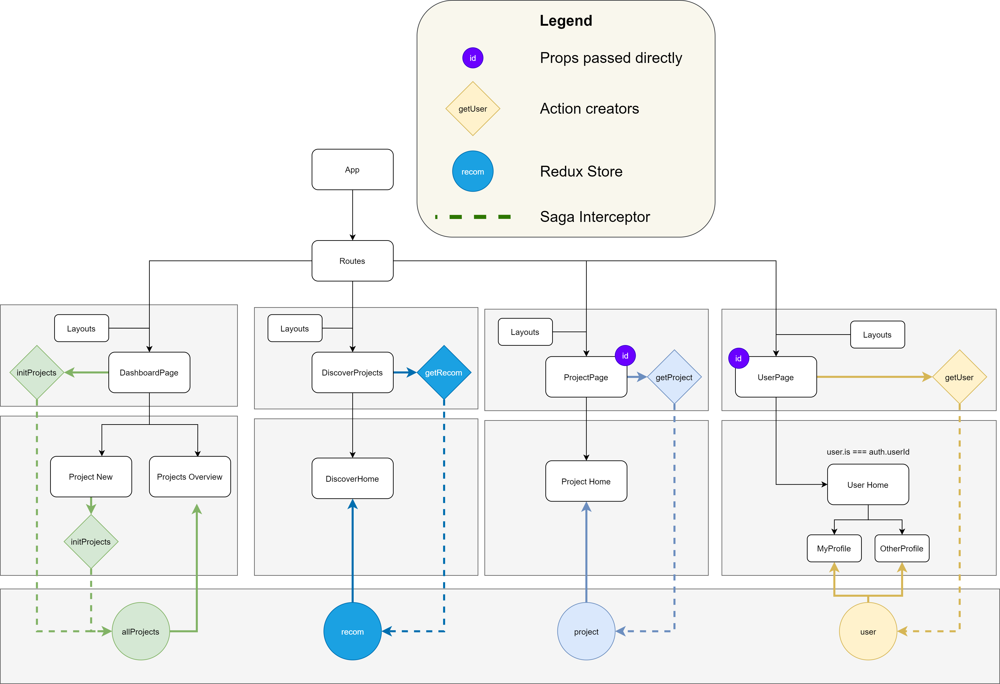

## The React Redux Client

This is what the current state of the application client like:

What is important here is the separation of concerns between contexts. There is a base Application component, 
which bootstraps a Router Component. The Router resolves the current path and injects a corresponding Page component at
runtime. There are only loose coupling between the router and the page components, as the former forwards no direct
props to the latter, und thus completely indifferent of what component to render. 

The router resolves the entire tree of components, rendering not only a requested page component, but also a concrete
representational component within it on the fly. Thus, there is no direct coupling between the logical and 
the representational components. 

The data is being stored in and taken from the Redux Store. It allows the components communicate through a mediator, so
that the concrete components do not have to know implementation details of their counterparts. It is meant to make the 
code scalable, as adding more components does not break the existing ones. 

Redux Saga is used for as the middleware to handle all possible side effects. For this reason, all the components are
implemented as pure functions, keeping up to the overall style of code. 
