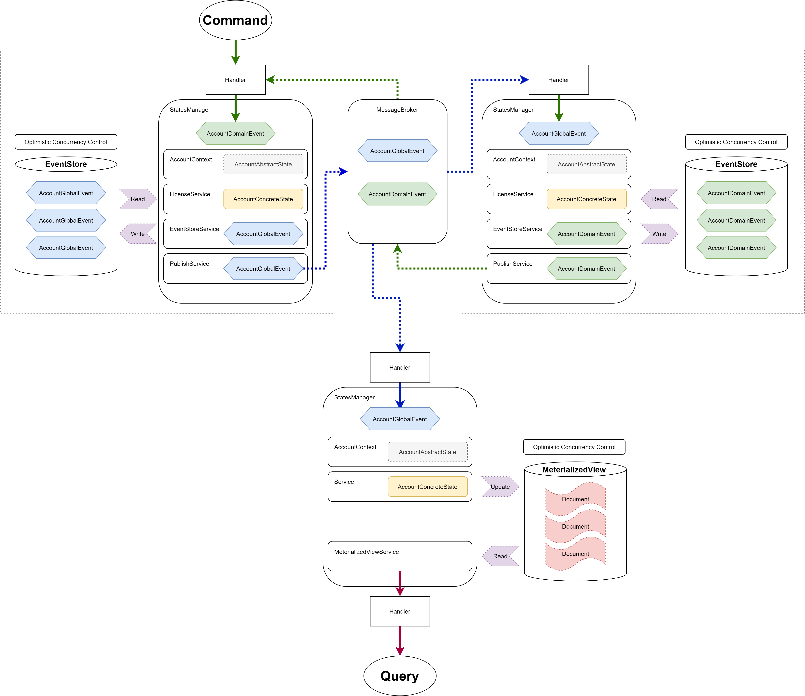

## The Application

This is what the accounts bounded context together with the materialized view would look like, if we apply
the Event Sourcing pattern to our application in the future.

## Event Sourcing pattern

More on the topic [here](https://docs.microsoft.com/en-us/azure/architecture/patterns/event-sourcing#when-to-use-this-pattern)

Instead of storing just the current state of the data in a domain, use an append-only store to record the full series of actions taken on that data. The store acts as the system of record and can be used to materialize the domain objects. This can simplify tasks in complex domains, by avoiding the need to synchronize the data model and the business domain, while improving performance, scalability, and responsiveness. It can also provide consistency for transactional data, and maintain full audit trails and history that can enable compensating actions.

The sequence of actions for reserving two seats is as follows:

1. The user interface issues a command to reserve seats for two attendees. The command is handled by a separate command handler. A piece of logic that is decoupled from the user interface and is responsible for handling requests posted as commands.
1. An aggregate containing information about all reservations for the conference is constructed by querying the events that describe bookings and cancellations. This aggregate is called SeatAvailability, and is contained within a domain model that exposes methods for querying and modifying the data in the aggregate.
1. The command handler invokes a method exposed by the domain model to make the reservations.
1. The SeatAvailability aggregate records an event containing the number of seats that were reserved. The next time the aggregate applies events, all the reservations will be used to compute how many seats remain.
1. The system appends the new event to the list of events in the event store.

If a user cancels a seat, the system follows a similar process except the command handler issues a command that generates a seat cancellation event and appends it to the event store.
As well as providing more scope for scalability, using an event store also provides a complete history, or audit trail, of the bookings and cancellations for a conference. The events in the event store are the accurate record. There is no need to persist aggregates in any other way because the system can easily replay the events and restore the state to any point in time.

The Event Sourcing pattern provides the following advantages:

* Events are immutable and can be stored using an append-only operation. The user interface, workflow, or process that initiated an event can continue, and tasks that handle the events can run in the background. This, combined with the fact that there's no contention during the processing of transactions, can vastly improve performance and scalability for applications, especially for the presentation level or user interface.

* Events are simple objects that describe some action that occurred, together with any associated data required to describe the action represented by the event. Events don't directly update a data store. They're simply recorded for handling at the appropriate time. This can simplify implementation and management.

* Events typically have meaning for a domain expert, whereas object-relational impedance mismatch can make complex database tables hard to understand. Tables are artificial constructs that represent the current state of the system, not the events that occurred.

* Event sourcing can help prevent concurrent updates from causing conflicts because it avoids the requirement to directly update objects in the data store. However, the domain model must still be designed to protect itself from requests that might result in an inconsistent state.

* The append-only storage of events provides an audit trail that can be used to monitor actions taken against a data store, regenerate the current state as materialized views or projections by replaying the events at any time, and assist in testing and debugging the system. In addition, the requirement to use compensating events to cancel changes provides a history of changes that were reversed, which wouldn't be the case if the model simply stored the current state. The list of events can also be used to analyze application performance and detect user behavior trends, or to obtain other useful business information.

* The event store raises events, and tasks perform operations in response to those events. This decoupling of the tasks from the events provides flexibility and extensibility. Tasks know about the type of event and the event data, but not about the operation that triggered the event. In addition, multiple tasks can handle each event. This enables easy integration with other services and systems that only listen for new events raised by the event store. However, the event sourcing events tend to be very low level, and it might be necessary to generate specific integration events instead.

* Event sourcing is commonly combined with the CQRS pattern by performing the data management tasks in response to the events, and by materializing views from the stored events.

### Event Sourcing and CQRS
The CQRS pattern is often used along with the Event Sourcing pattern. CQRS-based systems use separate read and write data models, each tailored to relevant tasks and often located in physically separate stores. When used with the Event Sourcing pattern, the store of events is the write model, and is the official source of information. The read model of a CQRS-based system provides materialized views of the data, typically as highly denormalized views. These views are tailored to the interfaces and display requirements of the application, which helps to maximize both display and query performance.

> Using the stream of events as the write store, rather than the actual data at a point in time, avoids update conflicts on a single aggregate and maximizes performance and scalability. The events can be used to asynchronously generate materialized views of the data that are used to populate the read store.
> Because the event store is the official source of information, it is possible to delete the materialized views and replay all past events to create a new representation of the current state when the system evolves, or when the read model must change. The materialized views are in effect a durable read-only cache of the data.
